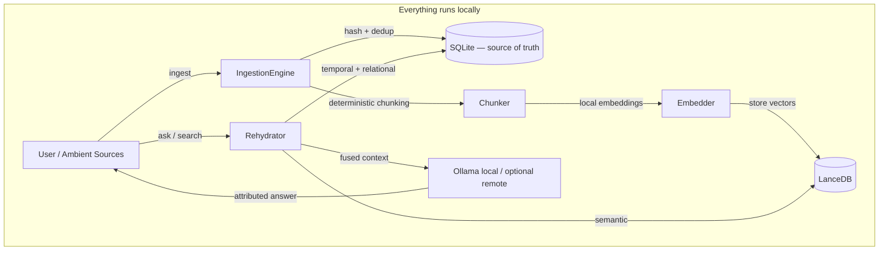

# UPII — your memory, on your machine

**Local-first memory for AI. Ingest your notes and documents, ask questions, get answers with citations — and no byte of your corpus ever leaves your device.**

[](LICENSE)
[](https://www.python.org/downloads/)

```
$ upii ask "What did we agree with ICEYE on resolution and latency?"

  Answer: You agreed on 0.5 m resolution imagery with a 6-hour delivery
  SLA, with latency relaxed to 12 hours during the pilot phase.

  Sources:
    [1] meetings/2026-03-14_iceye_sync.md   (chunk a3f2c9)
    [2] contracts/iceye_pilot_terms.md      (chunk 77d01b)
```

<!-- TODO: replace with demo.gif — 15s: ingest a folder, ask, cited answer, unplug wifi, ask again -->

> **Status:** early preview. The core capture, retrieval and ambient stack works
> and is tested, but interfaces are still moving.
>
> **Known gaps — worth knowing before you judge the claims above:**
> - **The relational retrieval signal is off by default.** Ingestion now populates
>   a local knowledge graph (people/orgs/projects) and `upii knowledge --graph`
>   renders it, but on the retrieval eval, letting the relational signal re-rank is
>   not yet net-positive (it can boost a chunk that merely *mentions* a query entity
>   over a better semantic match), so its fusion weight defaults to 0. Retrieval
>   today is effectively semantic + (recency-weighted) temporal; raise the signal
>   per query with `upii ask --w-relational`. Tuning it to help is ongoing.

## Why UPII

Most RAG and "second brain" tools upload your corpus to someone else's cloud and rent your own memory back to you. UPII inverts that:

- **100% local.** Embeddings ([sentence-transformers](https://www.sbert.net/) MiniLM), vector store ([LanceDB](https://lancedb.com/)), metadata (SQLite), and reasoning ([Ollama](https://ollama.com)) all run on-device. A remote LLM (Gemini) is optional and swappable — never required.
- **Every answer is cited.** Answers are attributed to source chunks by content-addressed ID. Retrieval is verifiable, not just plausible.
- **Deterministic, reproducible memory.** Chunk IDs are a pure function of content + config. Re-ingesting the same corpus reproduces 100% of chunk hashes — validated by tests and benchmarks. Citations stay stable across re-indexes; re-embedding is cache-safe.
- **More than cosine similarity.** The Context Rehydrator is built to fuse three signals — semantic (vectors), temporal ("what was I working on last week"), and relational (a local knowledge graph of people, projects, orgs, populated on ingest) — into one ranked context window, with per-signal contributions visible via `upii ask --debug`. Measured, not asserted: **Recall@10 = 0.958** on a committed labelled set ([reproduce it](eval/README.md)). The relational signal is live but weight-0 by default until it's tuned to help (see [Status](#status)); the score above is from semantic + temporal.
- **Consent-gated ambient capture.** A filesystem watcher keeps memory current, but sources are explicitly enabled and ambient events pass through an approval inbox before entering durable memory.
- **Graceful degradation.** No GPU, no API key, no internet? Retrieval still works and the system still answers.

## Quickstart

Requires Python 3.10–3.12.

```bash
pip install upii            # or: pipx install upii

upii doctor                 # verify the local stack (db, vectors, model, disk)
upii ingest ./notes --recursive
upii search "satellite latency"
upii ask "What did we agree with ICEYE on resolution and latency?"
```

First run downloads the embedding model (`all-MiniLM-L6-v2`, ~90 MB) — the only download UPII ever needs. For local reasoning, install [Ollama](https://ollama.com) and `ollama pull llama3.2`; without it, UPII falls back to retrieval + a deterministic mock, so it always responds.

### From source

```bash
git clone https://github.com/<you>/upii && cd upii
python3 -m venv venv && source venv/bin/activate   # Windows: venv\Scripts\activate
pip install -e ".[dev]"
pytest tests/ -q
```

## Usage

```bash
upii ingest ./notes --recursive   # build memory from a directory (idempotent)
upii search "satellite latency"   # semantic + attributed retrieval
upii ask "…"                      # cited answer over your corpus
upii write "follow-up" --target email   # synthesize in your voice
upii watch ./inbox                # ambient capture (consent-gated)
upii inbox                        # approve/reject ambient captures
upii knowledge --graph            # render the local knowledge graph to HTML
upii sources list                 # manage enabled sources
upii metrics show                 # observability
upii doctor                       # health check
```

Run `upii --help` for the full command set.

## How it works



Every write path — `ingest`, watch-approve, demo seed — flows through a single deterministic pipeline (`src/upii/ingestion/pipeline.py`):

- **Identity is content-addressed.** `doc_id = hash(content)`, `chunk_id = hash(chunk_text, config)`. No random UUIDs, no wall-clock, no path dependence. Same input ⇒ same memory state.
- **Dedup** — re-ingesting unchanged bytes is a no-op.
- **Edit** — a changed file re-chunks only what changed; unchanged chunk hashes stay stable; the prior version (chunks + vectors + metadata) is purged.
- **Delete** — removal cleans chunks, vectors, and metadata together.

Reproduce it yourself:

```bash
bash scripts/demo/repro_demo.sh                          # ingest → re-ingest → identical state
python scripts/bench/scale_check.py --docs 500 --paras 60   # scale + hash-reproducibility report
```

## How UPII compares

| | UPII | Cloud RAG / memory APIs | Typical local RAG |
|---|---|---|---|
| Corpus stays on device | ✅ always | ❌ | ✅ |
| Cited, chunk-level attribution | ✅ | varies | rarely |
| Reproducible ingestion (stable hashes) | ✅ 100% | ❌ | ❌ |
| Temporal + relational retrieval signals | ✅ both built; relational off by default ([status](#status)) | ❌ | ❌ cosine only |
| Works fully offline | ✅ | ❌ | usually |
| Consent-gated ambient capture | ✅ | ❌ | ❌ |

## Roadmap

- **Tune the relational signal to net-positive** — it re-ranks on knowledge-graph entity overlap but currently isn't a clear win on the eval, so it ships weight-0; make it help before enabling by default
- **Batched vector writes** — remove the per-document LanceDB append that caps ingestion throughput
- **MCP server** — expose `upii_search` / `upii_ask` as local MCP tools so Claude, Cursor, and other agents can use your private, cited memory ([scope](docs/mcp_server_scope.md))
- Mail + calendar connectors (consent-gated)
- Answer verification / abstention
- Signed installers for macOS, Windows, Linux
- `upii forget` — user-facing verified deletion

## Contributing

Issues and PRs welcome. Start with:

```bash
pip install -e ".[dev]" && pytest tests/ -q
```

Hard constraints for any change: local-first (no required cloud dependency), deterministic ingestion (same input ⇒ same chunk hashes), and consent-gating for any ambient capture path. See `tests/test_chunk_determinism.py` for the invariants that must hold.

## License

MIT © 2026 Maddy
